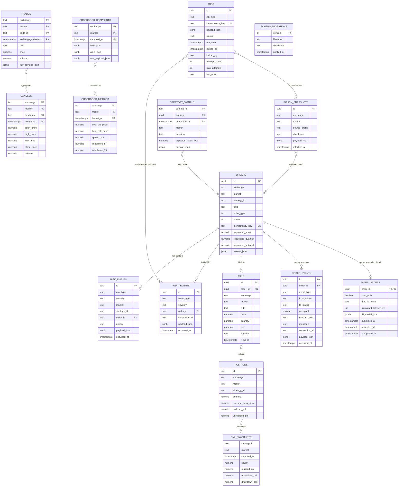

# M1 데이터베이스 스키마 아키텍처

## 목적

이 문서는 issue #3 M1 DB foundation에서 생성한 migration table의 역할, 관계, 비즈니스 의미를 설명한다. 런타임 구조 결정은 [`2026-05-13-mvp-runtime-architecture.md`](./2026-05-13-mvp-runtime-architecture.md)를 기준으로 하고, 이 문서는 저장소 스키마의 세부 책임만 다룬다.

## 핵심 결정

- PostgreSQL 일반 테이블은 주문, 포지션, 정책, 감사, 리스크, 작업 큐처럼 현재 상태와 업무 이벤트를 보관한다.
- TimescaleDB hypertable은 체결, 호가, 캔들, 전략 신호, PnL snapshot처럼 시간 축으로 누적되는 데이터를 보관한다.
- DB의 `market` 컬럼은 거래소별 심볼 형식을 강제하지 않고 비어 있지 않은 정규화 문자열만 요구한다. `KRW-BTC` 같은 Upbit KRW market code 검증은 adapter, config, policy boundary가 담당한다.
- `exchange`, `market`, `strategy_id`, time column 조합은 대부분의 조회 경계다. 거래소 확장 시 테이블을 새로 만들지 않고 같은 schema에 다른 `exchange` 값을 적재한다.

## jobs 테이블의 역할

`jobs`는 Redis나 BullMQ 없이 MVP runtime을 운영하기 위한 PostgreSQL 기반 작업 큐다. 주문이나 체결 같은 비즈니스 결과를 직접 표현하는 테이블이 아니라, 시스템이 수행해야 하는 일을 안전하게 예약하고 재시도하기 위한 operational table이다.

주요 사용 예시는 다음과 같다.

- 거래소 정책 snapshot 갱신
- market data 수집 보조 작업과 누락 구간 보정
- paper order reconciliation
- 알림 전송과 실패 재시도
- 일간 리포트 생성
- backup/restore smoke 검증 같은 운영 작업

핵심 컬럼 의미:

- `job_type`: worker가 실행할 작업 종류
- `idempotency_key`: 같은 업무 작업이 중복 생성되지 않게 막는 키
- `status`: `PENDING`, `RUNNING`, `COMPLETED`, `FAILED`, `CANCELED` 상태
- `run_after`: 예약 실행 시간
- `locked_at`, `locked_by`: worker claim 상태
- `attempt_count`, `max_attempts`, `last_error`: 재시도와 실패 진단

queue repository는 `jobs.idempotency_key` unique constraint로 중복 생성을 차단하고, `FOR UPDATE SKIP LOCKED` 패턴으로 `PENDING` job을 worker에 claim한다. worker가 실행을 마치면 완료 상태와 lock metadata를 갱신하고, 실패 retry 정책은 risk/state machine 단계에서 확장한다.

## 테이블 관계도

아래 Mermaid diagram은 물리 FK와 비즈니스 흐름을 함께 표시한다. 실제 FK는 `order_events.order_id`,
`paper_orders.order_id`, `fills.order_id`, `audit_events.order_id`, `risk_events.order_id`처럼 주문 ID를 직접
참조하는 관계에만 있다. 나머지는 `exchange`, `market`, `strategy_id`, timestamp를 공유하는 논리 관계다.

## 테이블별 비즈니스 책임

| 테이블 | 저장소 유형 | 역할 |
| --- | --- | --- |
| `schema_migrations` | PostgreSQL | 적용한 raw SQL migration의 version, filename, checksum을 기록한다. 재실행 skip과 checksum mismatch 탐지의 기준이다. |
| `orders` | PostgreSQL | 전략과 리스크 게이트를 통과한 주문 요청의 canonical record다. paper/live broker가 달라져도 주문 의도, idempotency, 상태는 이 테이블이 기준이다. |
| `order_events` | PostgreSQL | 주문 상태 전이의 canonical append-only event log다. `orders.status`는 현재 snapshot이고, 허용/거부된 전이 시도 전체는 이 테이블에서 조회한다. |
| `paper_orders` | PostgreSQL | paper trading 전용 실행 metadata다. 주문의 post-only 여부, simulated latency, fill model, 제출/승인/완료 시간을 분리해 live broker 확장 시 `orders`를 오염시키지 않는다. |
| `fills` | PostgreSQL | 주문의 부분 또는 전체 체결 record다. 비용, 수량, 유동성 구분을 기록하고 position/PnL 계산의 입력이 된다. |
| `positions` | PostgreSQL | `exchange + market + strategy_id` 단위 현재 포지션 snapshot이다. 체결 이벤트를 누적해 빠르게 현재 노출과 손익을 조회하기 위한 상태 테이블이다. |
| `policy_snapshots` | PostgreSQL | 거래소 정책, 호가 단위, 최소 주문금액, 수수료, market status 같은 외부 정책 payload를 checksum 기준으로 보관한다. 주문 전 검증과 사후 감사의 근거가 된다. |
| `trades` | TimescaleDB | 거래소 체결 stream의 정규화 원천 record다. 체결강도, 거래대금 급증, candle 생성, backtest 보정의 입력이다. |
| `orderbook_metrics` | TimescaleDB | 호가창에서 계산한 best bid/ask, spread, depth, imbalance, lag metric이다. 비용 모델과 리스크 게이트가 사용하는 빠른 조회용 지표다. |
| `orderbook_snapshots` | TimescaleDB | 특정 시점의 호가 원본 구조를 JSON으로 보관한다. slippage 추정, 체결 시뮬레이션, 장애 분석에 쓴다. |
| `candles` | TimescaleDB | timeframe별 OHLCV aggregate다. 전략 feature와 리포트, backtest 입력으로 사용한다. |
| `pnl_snapshots` | TimescaleDB | 전략 또는 market 단위 equity, realized/unrealized PnL, drawdown 시계열이다. 리스크 한도와 리포트의 기준 snapshot이다. |
| `strategy_signals` | TimescaleDB | 전략이 특정 시점에 낸 BUY/SELL/HOLD/BLOCK 판단과 기대수익률, 계산 payload를 보관한다. 주문이 왜 생겼거나 차단됐는지 추적한다. |
| `jobs` | PostgreSQL | scheduler와 worker 사이의 DB-backed queue다. 중복 작업 생성 방지, 예약 실행, worker lock, retry metadata를 제공한다. |
| `audit_events` | PostgreSQL | 사람이 나중에 따라갈 수 있는 운영/업무 감사 로그다. 주문 상태 변화, worker action, 외부 호출 결과 같은 사후 추적 정보를 보관한다. |
| `risk_events` | PostgreSQL | 리스크 게이트가 신규 주문을 차단하거나 경고한 이유를 구조화해 남긴다. market/strategy/order 기준으로 리스크 판단 이력을 조회한다. |

## 실행 영속성 저장 경계

- paper 실행 결과는 `orders.idempotency_key`를 durable 중복 방지 기준으로 삼는다. 같은 key가 재시도되면 기존 `orders`
  row를 반환하고 `paper_orders`, `fills`, `positions`, `order_events` side effect를 반복하지 않는다.
- 신규 paper 실행은 하나의 DB transaction 안에서 `orders` 생성, `paper_orders` 저장, 주문 상태 event append,
  `fills` 저장, `positions` snapshot 갱신을 처리한다. 이 경계가 깨지면 주문 현재 상태와 체결/포지션 근거가 어긋나므로
  repository는 부분 성공을 외부로 노출하지 않는다.
- `POST_ONLY`는 DB `paper_orders.time_in_force` check constraint에 넣지 않고 `paper_orders.post_only` boolean으로
  보존한다. `time_in_force`에는 broker 유효 시간 정책인 `GTC`, `IOC`, `FOK`만 저장한다.

## 확장 시 변경 원칙

- 새 거래소를 추가할 때는 기존 table에 `exchange` 값을 추가하고 adapter/policy validation을 확장한다. DB market check를 거래소별 regex로 되돌리지 않는다.
- 새 time-series feature가 기존 row grain과 다르면 새 hypertable을 만든다. 기존 `trades`나 `orderbook_metrics`에 의미가 다른 컬럼을 억지로 추가하지 않는다.
- `orders`는 broker 공통 주문 record로 유지한다. paper-only 또는 live-only metadata는 별도 companion table로 분리한다.
- 주문 상태값은 TypeScript `enum`이 아니라 `as const` 목록과 union type으로 중앙 관리하고, migration check constraint와
  state transition mapper가 같은 문자열 계약을 사용하게 한다.
- `jobs.payload_json`은 작업 입력을 담되, 장기 보존해야 하는 업무 결과를 `jobs`에만 두지 않는다. 결과는 domain table이나 audit/risk table에 기록한다.
- retention, compression, continuous aggregate는 migration으로 관리하되, 실제 운영 파라미터는 데이터 축적 후 별도 migration에서 조정한다.
